FSMC—扩展外部SRAM
-----------------

本章参考资料：《STM32F4XX-参考手册》FSMC章节。

关于SRAM存储器，请参考“常用存储器介绍”章节，实验中FLASH芯片的具体参数，请参考其规格书《IS62WV51216》来了解。

SRAM控制原理
~~~~~~~~~~~~

STM32控制器芯片内部有一定大小的SRAM及FLASH作为内存和程序存储空间，但当程序较大，内存和程序空间不足时，就需要在STM32芯片的外部扩展存储器了。

扩展内存时一般使用SRAM和SDRAM存储器，但STM32F407系列的芯片不支持扩展SDRAM(STM32F429系列支持)，
它仅支持使用FSMC外设扩展SRAM，我们以 SRAM为例讲解如何为STM32扩展内存。

给STM32芯片扩展内存与给PC扩展内存的原理是一样的，只是PC上一般以内存条的形式扩展，内存条实质是由多个内存颗粒(即SRAM芯片)组成的通用标准模块，而STM32直接与SRAM芯片连接。见 图26_2_，
这是我们实验板上使用的型号为IS62WV51216的SRAM芯片内部结构框图，以它为模型进行学习。

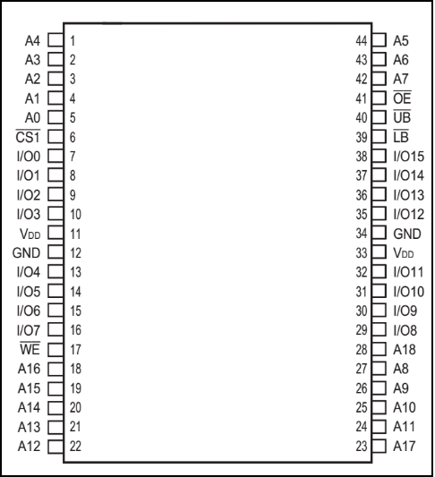

图 26‑1 SRAM芯片外观

.. image:: media/image2.png
   :align: center
   :alt: 图 26‑2 一种SRAM芯片的内部结构框图
   :name: 图26_2

图 26‑2 一种SRAM芯片的内部结构框图

SRAM信号线
^^^^^^^^^^

图 26‑2中左侧引出的是SRAM芯片的控制引脚，其说明见表 26‑1。

   表 26‑1 SRAM控制引脚说明

========== ==== =================================================================
信号线     类型 说明
A0-A18     I    地址输入
I/O0-I/O7  I/O  数据输入输出信号，低字节
I/O8-I/O15 I/O  数据输入输出信号，高字节
CS和CS1#   I    片选信号，CS2高电平有效，CS1#低电平有效，部分芯片只有其中一个引脚
OE#        I    输出使能信号，低电平有效
WE#        I    写入使能，低电平有效
UB#        I    数据掩码信号Upper Byte，高位字节允许访问，低电平有效
LB#        I    数据掩码信号Lower Byte，低位字节允许访问，低电平有效
========== ==== =================================================================

SRAM的控制比较简单，只要控制信号线使能了访问，从地址线输入要访问的地址，即可从I/O数据线写入或读出数据。

存储器矩阵
^^^^^^^^^^

框图中标号处表示的是存储器矩阵，这个SRAM芯片的空间大小为512Kx16(bits)，见 图26_3_。

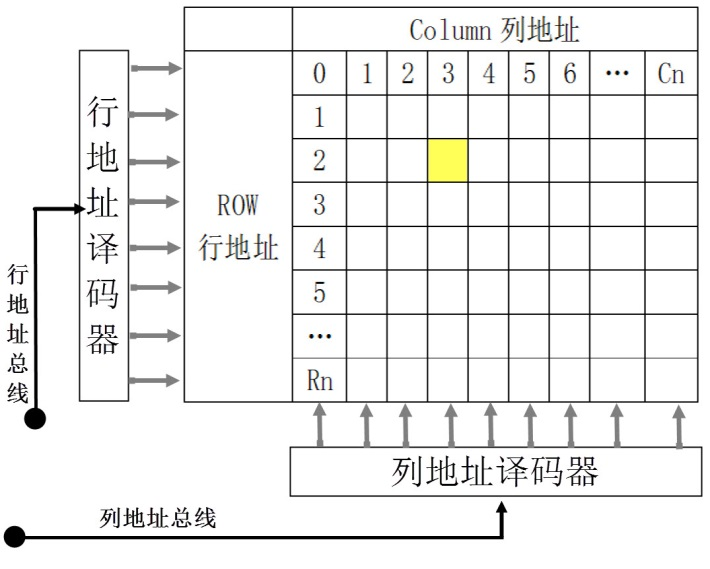

图 26‑3 SRAM存储阵列模型

SRAM内部包含的存储阵列，可以把它理解成一张表格，数据就填在这张表格上。和表格查找一样，指定一个行地址和列地址，就可以精确地找到目标单元格，这是SRAM芯片寻址的基本原理。这样的每个单元格被称为存储单元，而这样的表则被称为存储矩阵。

地址译码器、列I/O及I/O数据电路
^^^^^^^^^^^^^^^^^^^^^^^^^^^^^^

地址译码器把N根地址线转换成2\ :sup:`N`\ 根信号线，每根信号线对应一行或一列存储单元，通过地址线找到具体的存储单元，
实现寻址。如果存储阵列比较大，地址线会分成行和列地址，或者行、列分时复用同一地址总线，访问数据寻址时先用地
址线传输行地址再传输列地址。本实例中的SRAM比较小，没有列地址线，它的数据宽度为16位，即一个行地址对应2字节空间，框
图中左侧的A0-A18是行址信号，18根地址线一共可以表示2\ :sup:`18`\ =2\ :sup:`8`\ x1024=512K行存储单元，所以它一
共能访问512Kx16bits大小的空间。访问时，使用UB#或LB#线控制数据宽度，例如，当要访问宽度为16位的数据时，使用行地
址线指出地址，然后把UB#和LB#线都设置为低电平，那么I/O0-I/O15线都有效，它们一起输出该地址的16位数据(或者接收16
位数据到该地址)；当要访问宽度为8位的数据时，使用行地址线指出地址，然后把UB#或LB#其中一个设置为低电平，I/O会对
应输出该地址的高8位和低8位数据，因此它们被称为数据掩码信号。

控制电路
^^^^^^^^

控制电路主要包含了片选、读写使能以及上面提到的宽度控制信号UB#和LB#。利用CS2或CS1#片选信号，可以把多个SRAM芯片组成一个大容量的内存条。OE#和WE#可以控制读写使能，防止误操作。

SRAM的读写流程
^^^^^^^^^^^^^^

对SRAM进行读写数据时，它各个信号线的时序流程见 图26_4_ 及 图26_5_。

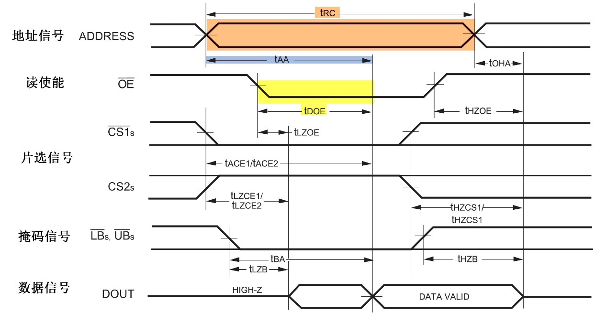

图 26‑4 SRAM的读时序

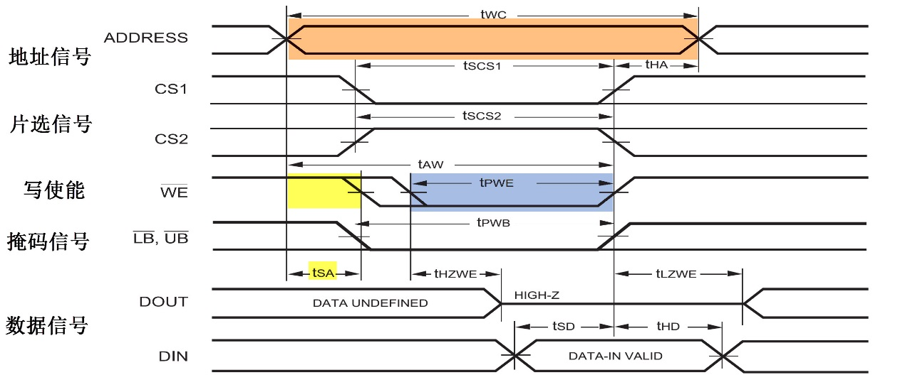

图 26‑5 SRAM的写时序

读写时序的流程很类似，下面我们统一解说：

(1) 主机使用地址信号线发出要访问的存储器目标地址；

(2) 控制片选信号CS1#及CS2#使能存储器芯片；

(3) 若是要进行读操作，则控制读使能信号OE#表示要读数据，若进行写操作则控制写使能信号WE#表示要写数据；

(4) 使用掩码信号LB#与UB#指示要访问目标地址的高、低字节部分；

(5) 若是读取过程，存储器会通过数据线向主机输出目标数据，若是写入过程，主要使用数据线向存储器传输目标数据。

在读写时序中，有几个比较重要的时间参数，在使用STM32
控制的时候需要参考，它们的介绍见表 26‑2。

表 26‑2 IS62WV51216BLL-55ns型号SRAM的时间参数

============= ================================= ======================================
时间参数      IS62WV51216BLL-55ns型号的时间要求 说明
t\ :sub:`RC`  不小于55ns                        读操作的总时间
t\ :sub:`AA`  最迟不大于55ns                    从接收到地址信号到给出有效数据的时间
t\ :sub:`DOE` 最迟不大于25ns                    从接收到读使能信号到给出有效数据的时间
t\ :sub:`WC`  不小于55ns                        写操作的总时间
t\ :sub:`SA`  大于0ns                           从发送地址信号到给出写有使能信号的时间
t\ :sub:`PWE` 不小于40ns                        从接收到写使能信号到数据采样的时间
============= ================================= ======================================

FSMC简介
~~~~~~~~

STM32F1系列芯片使用FSMC外设来管理扩展的存储器，FSMC是Flexible Static
Memory
Controller的缩写，译为灵活的静态存储控制器。它可以用于驱动包括SRAM、NOR
FLASH以及NAND
FLSAH类型的存储器，不能驱动如SDRAM这种动态的存储器而在STM32F429系列的控制器中，它具有FMC外设，支持控制SDRAM存储器。

FSMC框图剖析
~~~~~~~~~~~~

STM32的FSMC外设内部结构见 图26_6_。

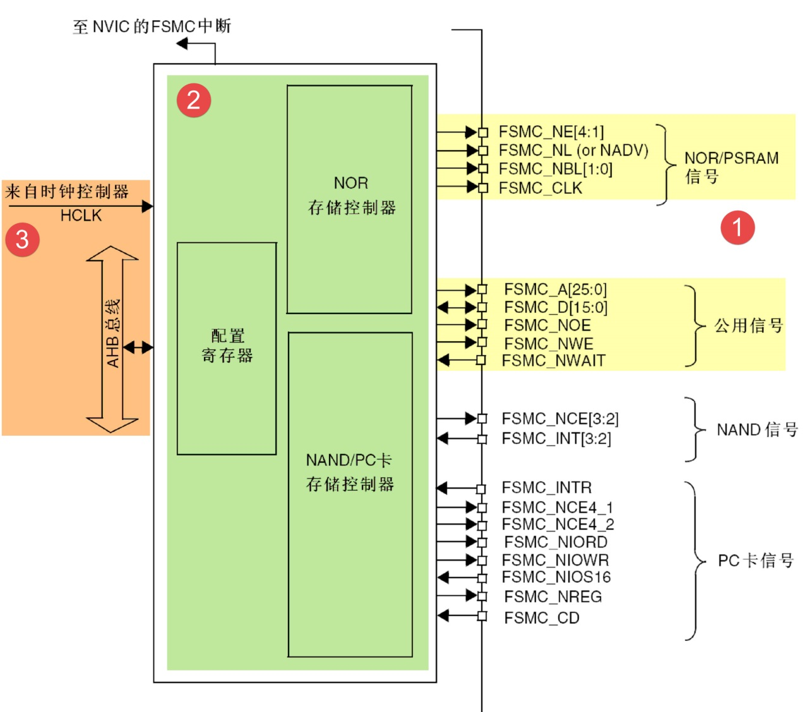

图 26‑6 FSMC控制器框图

通讯引脚
^^^^^^^^^^

在框图的右侧是FSMC外设相关的控制引脚，由于控制不同类型存储器的时候会有一些不同的引脚，看起来有非常多，其中地址线FSMC_A和数据线FSMC_D是所有控制器都共用的。这些FSMC引脚具体对应的GPIO端口及引脚号可在《STM32F103规格书》中搜索查找到，不在此列出。针对本示例中的SRAM控制器，我们整理出以下的FSMC与SRAM引脚对照表
26‑3。

   表 26‑3 FSMC中的SRAM控制信号线

============= ============== ================
FSMC引脚名称  对应SRAM引脚名 说明
FSMC_NBL[1:0] LB#、UB#       数据掩码信号
FSMC_A[18:0]  A[18:0]        行地址线
FSMC_D[15:0]  I/O[15:0]      数据线
FSMC_NWE      WE#            写入使能
FSMC_NOE      OE#            输出使能(读使能)
FSMC_NE[1:4]  CE#            片选信号
============= ============== ================

其中比较特殊的FSMC_NE是用于控制SRAM芯片的片选控制信号线，STM32具有FSMC_NE1/2/3/4号引脚，不同的引脚对应STM32内部不同的地址区域。例如，当STM32访问0x6C000000-0x6FFFFFFF地址空间时，FSMC_NE3引脚会自动设置为低电平，由于它连接到SRAM的CE#引脚，所以SRAM的片选被使能，而访问0x60000000-0x63FFFFFF地址时，FSMC_NE1会输出低电平。当使用不同的FSMC_NE引脚连接外部存储器时，STM32访问SRAM的地址不一样，从而达到控制多块SRAM芯片的目的。各引脚对应的地址会在后面“FSMC的地址映射”小节讲解。

存储器控制器
^^^^^^^^^^^^^^^^^^^^

上面不同类型的引脚是连接到FSMC内部对应的存储控制器中的。NOR/PSRAM/SRAM设备使用相同的控制器，NAND/PC卡设备使用相同的控制器，不同的控制器有专用的寄存器用于配置其工作模式。

控制SRAM的有FSMC_BCR1/2/3/4控制寄存器、FSMC_BTR1/2/3/4片选时序寄存器以及FSMC_BWTR1/2/3/4写时序寄存器。每种寄存器都有4个，分别对应于4个不同的存储区域，各种寄存器介绍如下：

-  FSMC_BCR控制寄存器可配置要控制的存储器类型、数据线宽度以及信号有效极性能参数。

-  FMC_BTR时序寄存器用于配置SRAM访问时的各种时间延迟，如数据保持时间、地址保持时间等。

-  FMC_BWTR写时序寄存器与FMC_BTR寄存器控制的参数类似，它专门用于控制写时序的时间参数。

时钟控制逻辑
^^^^^^^^^^^^^^^^^^^^

FSMC外设挂载在AHB总线上，时钟信号来自于HCLK(默认168MHz)，控制器的同步时钟输出就是由它分频得到。例如，NOR控制器的FSMC_CLK引脚输出的时钟，它可用于与同步类型的SRAM芯片进行同步通讯，它的时钟频率可通过FSMC_BTR寄存器的CLKDIV位配置，可以配置为HCLK的1/2或1/3，也就是说，若它与同步类型的SRAM通讯时，同步时钟最高频率为84MHz。本示例中的SRAM为异步类型的存储器，不使用同步时钟信号，所以时钟分频配置不起作用。

FSMC的地址映射
~~~~~~~~~~~~~~

FSMC连接好外部的存储器并初始化后，就可以直接通过访问地址来读写数据，这种地址访问与I2C EEPROM、SPI FLASH的不一样，
后两种方式都需要控制I2C或SPI总线给存储器发送地址，然后获取数据；在程序里，这个地址和数据都需要分开使用不同的变量存储，
并且访问时还需要使用代码控制发送读写命令。而使用FSMC外接存储器时，其存储单元是映射到STM32的内部寻址空间的；在程序里，定义一个指向这些地址的指针，然后就可以通过指针直接修改该存储单元的内容，FSMC外设会自动完成数据访问过程，读写命令之类的操作不需要程序控制。FSMC的地址映射见见
图26_7_。

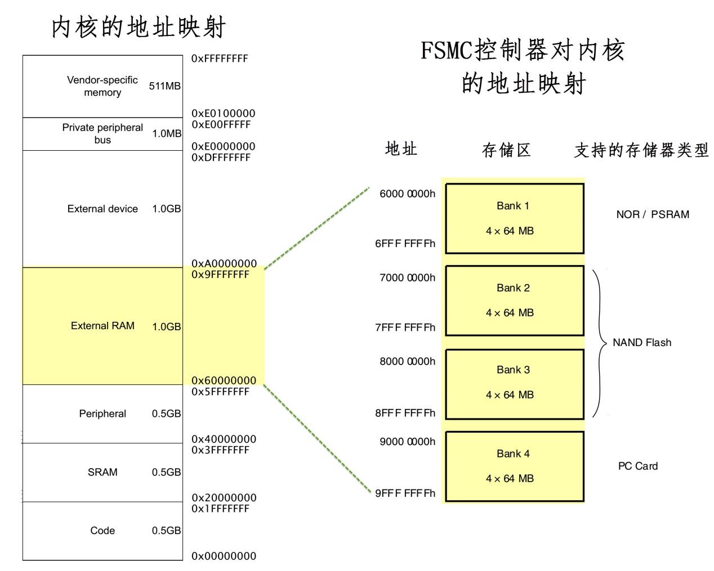

图 26‑7 FSMC的地址映射

图中左侧的是Cortex-M4内核的存储空间分配，右侧是STM32 FSMC外设的地址映射。
可以看到FSMC的NOR/PSRAM/SRAM/NAND FLASH以及PC卡的地址都在External RAM地址空间内。
正是因为存在这样的地址映射，使得访问FSMC控制的存储器时，
就跟访问STM32的片上外设寄存器一样(片上外设的地址映射即图中左侧的“Peripheral”区域)。

FSMC把整个External RAM存储区域分成了4个Bank区域，并分配了地址范围及适用的存储器类型，
如NOR及SRAM存储器只能使用Bank1的地址。
在每个Bank的内部又分成了4个小块，每个小块有相应的控制引脚用于连接片选信号，如FSMC_NE[4:1]信号线可用于选择BANK1内部的4小块地址区域，见
图26_8_，当STM32访问0x6C000000-0x6FFFFFFF地址空间时，会访问到Bank1的第3小块区域，相应的FSMC_NE3信号线会输出控制信号。

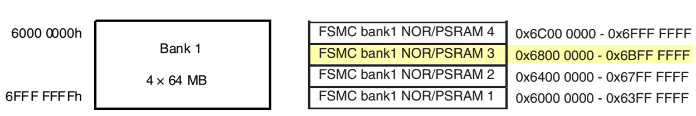

图 26‑8 Bank1内部的小块地址分配

FSMC控制SRAM的时序
~~~~~~~~~~~~~~~~~~

FSMC外设支持输出多种不同的时序以便于控制不同的存储器，它具有ABCD四种模式，下面我们仅针对控制SRAM使用的模式A进行讲解，见
图26_9_ 及 图26_10_。

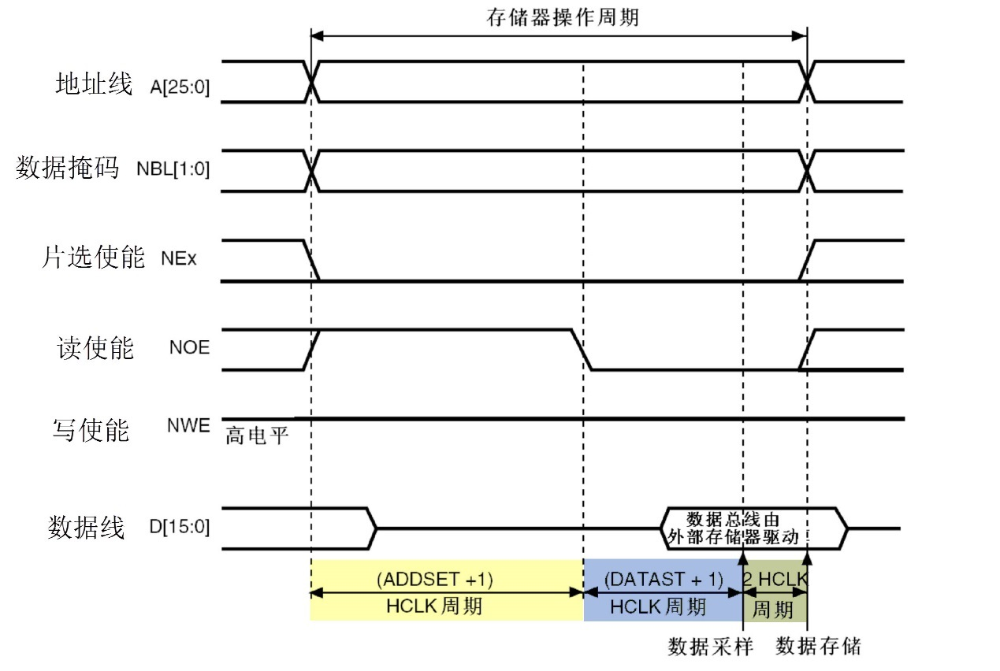

图 26‑9 FSMC模式A的读时序

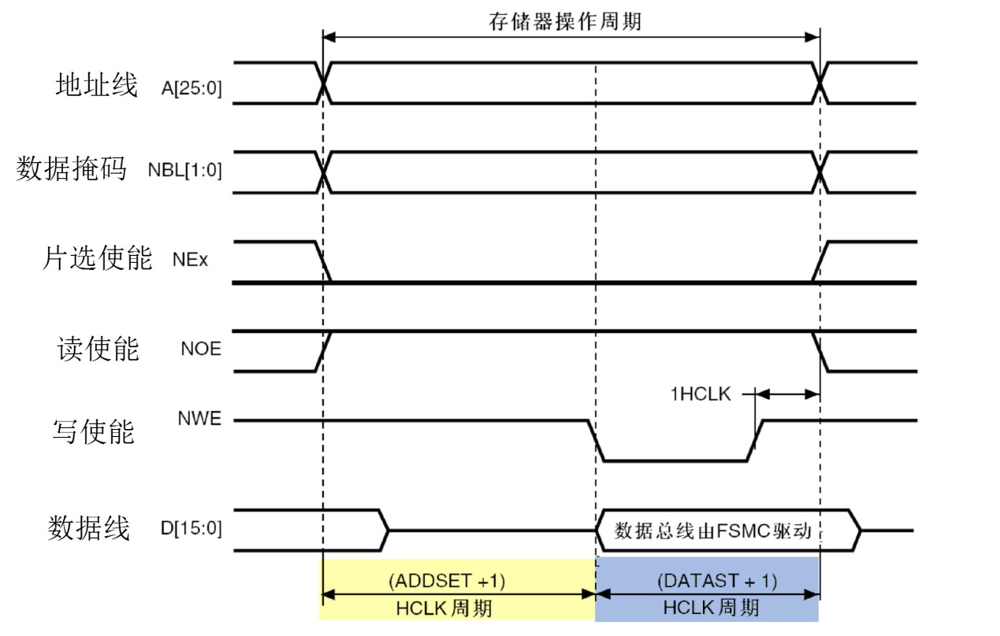

图 26‑10 FSMC模式A的写时序

当内核发出访问某个指向外部存储器地址时，FSMC外设会根据配置控制信号线产生时序访问存储器，上图中的是访问外部SRAM时FSMC外设的读写时序。

以读时序为例，该图表示一个存储器操作周期由地址建立周期(ADDSET)、数据建立周期(DATAST)以及2个HCLK周期组成。在地址建立周期中，地址线发出要访问的地址，数据掩码信号线指示出要读取地址的高、低字节部分，片选信号使能存储器芯片；地址建立周期结束后读使能信号线发出读使能信号，接着存储器通过数据信号线把目标数据传输给FSMC，FSMC把它交给内核。

写时序类似，区别是它的一个存储器操作周期仅由地址建立周期(ADDSET)和数据建立周期(DATAST)组成，且在数据建立周期期间写使能信号线发出写信号，接着FSMC把数据通过数据线传输到存储器中。

SRAM时序结构体
~~~~~~~~~~~~~~

控制FSMC使用SRAM存储器时主要是配置时序寄存器以及控制寄存器，利用HAL库的SRAM时序结构体以及初始化结构体可以很方便地写入参数。

SRAM时序结构体的成员见 代码清单26_0_1_。

.. code-block:: c
   :caption: 代码清单 26‑1 SRAM时序结构体FSMC_NORSRAMTimingInitTypeDef
   :name: 代码清单26_0_1

   typedef struct
   {
      uint32_t FSMC_AddressSetupTime;       /*地址建立时间，0-0xF个HCLK周期*/
      uint32_t FSMC_AddressHoldTime;        /*地址保持时间，0-0xF个HCLK周期*/
      uint32_t FSMC_DataSetupTime;           /*地址建立时间，0-0xF个HCLK周期*/
      uint32_t FSMC_BusTurnAroundDuration;/*总线转换周期,0-0xF个HCLK周期，在NOR FLASH */
      uint32_t FSMC_CLKDivision;/*时钟分频因子,1-0xF，若控制异步存储器，本参数无效 */
      uint32_t FSMC_DataLatency;    /*数据延迟时间，若控制异步存储器，本参数无效 */
      uint32_t FSMC_AccessMode;             /*设置访问模式 */
   }FSMC_NORSRAMTimingInitTypeDef;

这个结构体成员定义的都是SRAM读写时序中的各项时间参数，这些成员的的参数都与FSMC_BRT及FSMC_BWTR寄存器配置对应，各个成员介绍如下：

(1) FSMC_AddressSetupTime

..

   本成员设置地址建立时间，即FSMC读写时序 图26_9_
   中的ADDSET值，它可以被设置为0-0xF个HCLK周期数，按STM32HAL库的默认配置，HCLK的时钟频率为168MHz，即一个HCLK周期为1/168微秒。

(2) FSMC_AddressHoldTime

..

   本成员设置地址保持时间，它可以被设置为0-0xF个HCLK周期数。

(3) FSMC_DataSetupTime

..

   本成员设置数据建立时间，即FSMC读写时序 图26_10_ 中的DATAST值，它可以被设置为0-0xF个HCLK周期数。

(4) FSMC_BusTurnAroundDuration

..

   本成员设置总线转换周期，在NOR FLASH存储器中，地址线与数据线可以分时复用，总线转换周期就是指总线在这两种状态间切换需要的延时，
   防止冲突。控制其它存储器时这个参数无效，配置为0即可。

(5) FSMC_CLKDivision

..

   本成员用于设置时钟分频，它以HCLK时钟作为输入，经过FSMC_CLKDivision分频后输出到FSMC_CLK引脚作为通讯使用的同步时钟。控制其它异步通讯的存储器时这个参数无效，配置为0即可。

(6) FSMC_DataLatency

..

   本成员设置数据保持时间，它表示在读取第一个数据之前要等待的周期数，该周期指同步时钟的周期，本参数仅用于同步NOR
   FLASH类型的存储器，控制其它类型的存储器时，本参数无效。

(7) FSMC_AccessMode

   本成员设置存储器访问模式，不同的模式下FSMC访问存储器地址时引脚输出的时序不一样，可选FSMC_ACCESS_MODE_A/B/C/D模式。一般来说控制SRAM时使用A模式。

这个FSMC_NORSRAM_TimingTypeDef时序结构体配置的延时参数，将作为下一节的FSMC
SRAM初始化结构体的一个成员。

SRAM初始化结构体
~~~~~~~~~~~~~~~~

FSMC的SRAM初始化结构体见 代码清单26_0_2_。

.. code-block:: c
   :caption: 代码清单 26‑2 SRAM初始化结构体FSMC_NORSRAMInitTypeDef
   :name: 代码清单26_0_2

   /**
   * @brief  FSMC NOR/SRAM Init structure definition
   */
   typedef struct
   {
      uint32_t NSBank;                /*设置要控制的Bank区域 */
      uint32_t DataAddressMux;        /*设置地址总线与数据总线是否复用 */
      uint32_t MemoryType;          /*设置存储器的类型 */
      uint32_t MemoryDataWidth;     /*设置存储器的数据宽度*/
      uint32_t BurstAccessMode;        /*设置是否支持突发访问模式，只支持同步类型的存储器 */
      uint32_t WaitSignalPolarity;  /*设置等待信号的极性*/
      uint32_t WrapMode;            /*设置是否支持对齐的突发模式 */
      uint32_t WaitSignalActive;    /*配置等待信号在等待前有效还是等待期间有效 */
      uint32_t WriteOperation;      /*设置是否写使能 */
      uint32_t WaitSignal;          /*设置是否使能等待状态插入 */
      uint32_t ExtendedMode;        /*设置是否使能扩展模式 */
      uint32_t WriteBurst;          /*设置是否使能写突发操作*/
      uint32_t AsynchronousWait;    /*设置是否使能等待信号*/
      uint32_t ContinuousClock;     /*设置是否使能FMC时钟输出到外部存储设备*/
      uint32_t WriteFifo;           /*设置是否使能FIFO*/
      uint32_t PageSize;            /*指定页的大小*/
      /*当不使用扩展模式时，本参数用于配置读写时序，否则用于配置读时序*/
      FSMC_NORSRAM_TimingTypeDef* FSMC_ReadWriteTimingStruct;
      /*当使用扩展模式时，本参数用于配置写时序*/
      FSMC_NORSRAM_TimingTypeDef * FSMC_WriteTimingStruct;
   } FSMC_NORSRAM_InitTypeDef;

这个结构体，除最后两个成员是上一小节讲解的时序配置外，其它结构体成员的配置都对应到FSMC_BCR中的寄存器位。各个成员意义介绍如下，括号中的是STM32HAL库定义的宏：

(1) NSBank

..

   本成员用于选择FSMC映射的存储区域，它的可选参数以及相应的内核地址映射范围见表
   26‑4。

   表 26‑4 可以选择的存储器区域及区域对应的地址范围

=================== =====================
可以输入的宏        对应的地址区域
FSMC_Bank1_NORSRAM1 0x60000000-0x63FFFFFF
FSMC_Bank1_NORSRAM2 0x64000000-0x67FFFFFF
FSMC_Bank1_NORSRAM3 0x68000000-0x6BFFFFFF
FSMC_Bank1_NORSRAM4 0x6C000000-0x6FFFFFFF
=================== =====================

(2) DataAddressMux

..

   本成员用于设置地址总线与数据总线是否复用(FSMC_DATA_ADDRESS_MUX_DISABLE
   /DISABLE)，在控制NOR
   FLASH时，可以地址总线与数据总线可以分时复用，以减少使用STM32信号线的数量。

(3) MemoryType

..

   本成员用于设置要控制的存储器类型，它支持控制的存储器类型为SRAM、PSRAM以及NOR
   FLASH(FSMC_MEMORY_TYPE_SRAM/PSRAM/NOR)。

(4) MemoryDataWidth

..

   本成员用于设置要控制的存储器的数据宽度，可选择设置成8或16位(FSMC_NORSRAM_MEM_BUS_WIDTH_8/16/32)。

(5) BurstAccessMode

..

   本成员用于设置是否使用突发访问模式(FSMC_BURST_ACCESS_MODE_DISABLE
   /DISABLE)，突发访问模式是指发送一个地址后连续访问多个数据，非突发模式下每访问一个数据都需要输入一个地址，仅在控制同步类型的存储器时才能使用突发模式。

(6) AsynchronousWait

..

   本成员用于设置是否使能在同步传输时使用的等待信号(FSMC_ASYNCHRONOUS_WAIT_DISABLE
   /DISABLE)，在控制同步类型的NOR或PSRAM时，存储器可以使用FSMC_NWAIT引脚通知STM32需要等待。

(7) WaitSignalPolarity

..

   本成员用于设置等待信号的有效极性，即要求等待时，使用高电平还是低电平(FSMC_WAIT_SIGNAL_POLARITY_LOW
   /HIGH)。

(8) FSMC_WrapMode

..

   本成员用于设置是否支持把非对齐的AHB突发操作分割成2次线性操作(FSMC_WRAP_MODE_DISABLE
   /ENABLE)，该配置仅在突发模式下有效。

(9) WaitSignalActive

..

   本成员用于配置在突发传输模式时，决定存储器是在等待状态之前的一个数据周期有效还是在等待状态期间有效(FSMC_WAIT_TIMING_BEFORE_WS
   / FSMC_WAIT_TIMING_DURING_WS)。

(10) WriteOperation

..

   这个成员用于设置是否写使能(FSMC_WRITE_OPERATION_DISABLE
   /ENABLE)，禁止写使能的话FSMC只能从存储器中读取数据，不能写入。

(11) WaitSignal

..

   本成员用于设置当存储器处于突发传输模式时，是否允许通过NWAIT信号插入等待状态(FSMC_WAIT_SIGNAL_ENABLE
   /DISABLE)。

(12) ExtendedMode

..

   本成员用于设置是否使用扩展模式(FSMC_EXTENDED_MODE_ENABLE
   /DISABLE)，在非扩展模式下，对存储器读写的时序都只使用FSMC_BCR寄存器中的配置，即下面的FSMC_ReadWriteTimingStruct结构体成员；在扩展模式下，对存储器的读写时序可以分开配置，读时序使用FSMC_BCR寄存器，写时序使用FSMC_BWTR寄存器的配置，即下面的FSMC_WriteTimingStruct结构体。

对本结构体赋值完成后，调用FSMC_NORSRAMInit库函数即可把配置参数写入到FSMC_BCR及FSMC_BTR/BWTR寄存器中。

FSMC—扩展外部SRAM实验
~~~~~~~~~~~~~~~~~~~~~

本小节以型号为“IS62WV51216”的SRAM芯片为STM32扩展内存。它的地址线宽度为19位，数据线宽度为16位，容量大小为1MB。

学习本小节内容时，请打开配套的“FSMC—外部SRAM”工程配合阅读。本实验仅讲解基本的外部SRAM驱动，不涉及内存管理的内容，在本书的《MDK编译过程及文件类型全解》章节将会讲解使用更简单的方法从外部SRAM中分配变量，以及使用C语言HAL库的malloc函数来分配外部SRAM的空间。

硬件设计
^^^^^^^^

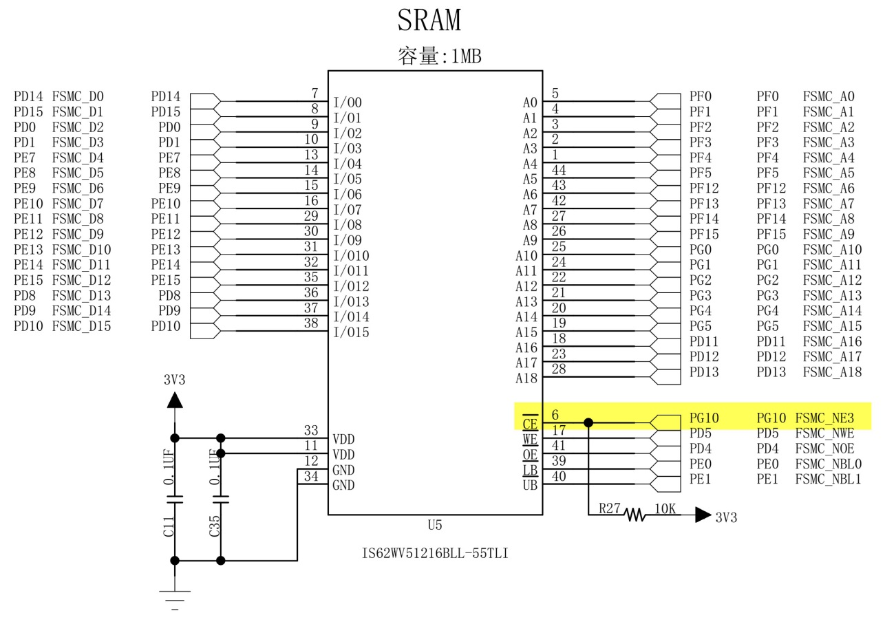

图 26‑11 外部SRAM硬件连接图

外部SRAM芯片与STM32相连的引脚非常多，主要是地址线和数据线，这些具有特定FSMC功能的GPIO引脚可查询《STM32F4xx规格书》中的说明来了解。

关于该SRAM芯片的更多信息，请参考其规格书《IS62WV51216》了解。若您使用的实验板SRAM的型号或控制引脚不一样，可在我们工程的基础上修改，程序的控制原理相同。

根据本硬件设计，SRAM芯片的使能信号与FSMC_NE4连接，所以它会被映射到STM32中的BANK1 NOR/SRAM 4区域，
该区域的地址范围为0x6C000000-0x6FFFFFFF，因此，当内核访问从基地址0x6C000000开始的1MB空间时，
FSMC外设会自动控制原理图中的引脚产生访问时序，访问这个外部SRAM存储器。

软件设计
^^^^^^^^

为了使工程更加有条理，我们把SRAM初始化相关的代码独立分开存储，方便以后移植。在“工程模板”之上新建“bsp_sram.c”及“bsp_sram.h”文件，这些文件也可根据您的喜好命名，它们不属于STM32HAL库的内容，是由我们自己根据应用需要编写的。

编程要点
''''''''

(1) 初始化通讯使用的目标引脚及端口时钟；

(2) 使能FSMC外设的时钟；

(3) 配置FSMC SRAM的时序、工作模式；

(4) 建立机制访问外部SRAM存储器；

(5) 编写测试程序，对读写数据进行校验。

代码分析
'''''''''

FSMC硬件相关宏定义
=========================

我们把FSMC SRAM硬件相关的配置都以宏的形式定义到
“sram.h”文件中，见 代码清单26_0_3_。

.. code-block:: c
   :caption: 代码清单 26‑3 SRAM硬件配置相关的宏(省略了大部分数据线，sram.h文件)
   :name: 代码清单26_0_3

   /*地址信号线*/
   #define FMC_A0_GPIO_PORT         GPIOF
   #define FMC_A0_GPIO_CLK()        __GPIOF_CLK_ENABLE()
   #define FMC_A0_GPIO_PIN          GPIO_PIN_0
   /*省略一些引脚*/
   #define FMC_A11_GPIO_PORT        GPIOG
   #define FMC_A11_GPIO_CLK()       __GPIOG_CLK_ENABLE()
   #define FMC_A11_GPIO_PIN         GPIO_PIN_2

   /*数据信号线*/
   #define FMC_D0_GPIO_PORT         GPIOD
   #define FMC_D0_GPIO_CLK()        __GPIOD_CLK_ENABLE()
   #define FMC_D0_GPIO_PIN          GPIO_PIN_14

   /*省略一些引脚*/
   #define FMC_D15_GPIO_PORT        GPIOD
   #define FMC_D15_GPIO_CLK()       __GPIOD_CLK_ENABLE()
   #define FMC_D15_GPIO_PIN         GPIO_PIN_10

   /*控制信号线*/
   #define FMC_CS_GPIO_PORT         GPIOH
   #define FMC_CS_GPIO_CLK()        __GPIOH_CLK_ENABLE()
   #define FMC_CS_GPIO_PIN          GPIO_PIN_6

   #define FMC_BA0_GPIO_PORT        GPIOG
   #define FMC_BA0_GPIO_CLK()       __GPIOG_CLK_ENABLE()
   #define FMC_BA0_GPIO_PIN         GPIO_PIN_4

   #define FMC_BA1_GPIO_PORT        GPIOG
   #define FMC_BA1_GPIO_CLK()       __GPIOG_CLK_ENABLE()
   #define FMC_BA1_GPIO_PIN         GPIO_PIN_5

   #define FMC_WE_GPIO_PORT         GPIOC
   #define FMC_WE_GPIO_CLK()        __GPIOC_CLK_ENABLE()
   #define FMC_WE_GPIO_PIN          GPIO_PIN_0

   #define FMC_RAS_GPIO_PORT        GPIOF
   #define FMC_RAS_GPIO_CLK()       __GPIOF_CLK_ENABLE()
   #define FMC_RAS_GPIO_PIN         GPIO_PIN_11

   #define FMC_CAS_GPIO_PORT        GPIOG
   #define FMC_CAS_GPIO_CLK()       __GPIOG_CLK_ENABLE()
   #define FMC_CAS_GPIO_PIN         GPIO_PIN_15

   #define FMC_CLK_GPIO_PORT        GPIOG
   #define FMC_CLK_GPIO_CLK()       __GPIOG_CLK_ENABLE()
   #define FMC_CLK_GPIO_PIN         GPIO_PIN_8

   #define FMC_CKE_GPIO_PORT        GPIOH
   #define FMC_CKE_GPIO_CLK()       __GPIOH_CLK_ENABLE()
   #define FMC_CKE_GPIO_PIN         GPIO_PIN_7

   /*UDQM LDQM*/
   #define FMC_UDQM_GPIO_PORT        GPIOE
   #define FMC_UDQM_GPIO_CLK()       __GPIOE_CLK_ENABLE()
   #define FMC_UDQM_GPIO_PIN         GPIO_PIN_1

   #define FMC_LDQM_GPIO_PORT        GPIOE
   #define FMC_LDQM_GPIO_CLK()       __GPIOE_CLK_ENABLE()
   #define FMC_LDQM_GPIO_PIN         GPIO_PIN_0

以上代码根据硬件的连接，把与SRAM通讯使用的引脚端口、引脚号以及时钟都以宏封装起来。其中FSMC_CS作为片选引脚对应的是FSMC_NE3，所以后面我们对SDRAM的寻址空间也是要指向存储区域BANK1
NOR/SRAM 3的。

初始化FSMC的 GPIO
=======================

利用上面的宏，编写FSMC的GPIO引脚初始化函数，见 代码清单26_0_4_。

.. code-block:: c
   :caption: 代码清单 26‑4 FSMC的GPIO初始化函数(省略了大部分数据线，sram.c文件)
   :name: 代码清单26_0_4

   /**
   * @brief  初始化控制SRAM的IO
   * @param  无
   * @retval 无
   */
   static void SRAM_GPIO_Config(void)
   {
      GPIO_InitTypeDef GPIO_InitStructure;

      /*此处省略大量地址线、数据线以及控制信号线，
      它们的时钟配置都相同，具体请查看工程中的代码*/
      /* 使能SDRAM相关的GPIO时钟 */
      /*地址信号线*/
      FMC_A0_GPIO_CLK();FMC_A1_GPIO_CLK(); FMC_A2_GPIO_CLK();
      /*数据信号线*/  /*控制信号线*/
      FMC_UDQM_GPIO_CLK();FMC_LDQM_GPIO_CLK();
      /*-- GPIO 配置 -----------------------------------------------------*/

      /* 通用 GPIO 配置 */
      /*--所有GPIO的配置都相同，此处省略大量引脚初始化，具体请查看工程中的代码*/
      GPIO_InitStructure.Mode = GPIO_MODE_AF_PP;//配置为复用功能
      GPIO_InitStructure.Pull = GPIO_PULLUP;
      GPIO_InitStructure.Speed = GPIO_SPEED_HIGH;
      GPIO_InitStructure.Alternate = GPIO_AF12_FMC;

      /*A行列地址信号线 针对引脚配置*/
      GPIO_InitStructure.Pin = FMC_A0_GPIO_PIN;
      HAL_GPIO_Init(FMC_A0_GPIO_PORT, &GPIO_InitStructure);

      /*...*/
      /*DQ数据信号线 针对引脚配置*/
      GPIO_InitStructure.Pin = FMC_D0_GPIO_PIN;
      HAL_GPIO_Init(FMC_D0_GPIO_PORT, &GPIO_InitStructure);

      /*...*/
      /*控制信号线*/
      GPIO_InitStructure.Pin = FMC_CS_GPIO_PIN;
      HAL_GPIO_Init(FMC_CS_GPIO_PORT, &GPIO_InitStructure);
      /*...*/
   }

与所有使用到GPIO的外设一样，都要先把使用到的GPIO引脚模式初始化，以上代码把FSMC
SRAM的所有信号线全都初始化为复用功能，所有引脚配置都是一样的。

配置FSMC的模式
=================

接下来需要配置FSMC
SRAM的工作模式，这个函数的主体是根据硬件连接的SRAM特性，对时序结构体以及初始化结构体进行赋值。见
代码清单26_0_5_。

.. code-block:: c
   :caption: 代码清单 26‑5 配置FSMC的模式(sram.c文件)
   :name: 代码清单26_0_5

   void FSMC_SRAM_Init(void)
   {
      SRAM_Handler.Instance = FMC_NORSRAM_DEVICE;
      SRAM_Handler.Extended = FMC_NORSRAM_EXTENDED_DEVICE;

      /* SRAM device configuration */
      Timing.AddressSetupTime      = 0x00;
      Timing.AddressHoldTime       = 0x00;
      Timing.DataSetupTime         = 0x08;
      Timing.BusTurnAroundDuration = 0x00;
      Timing.CLKDivision           = 0x00;
      Timing.DataLatency           = 0x00;
      Timing.AccessMode            = FSMC_ACCESS_MODE_A;
      //使用NE4
      SRAM_Handler.Init.NSBank=FSMC_NORSRAM_BANK4;
      //地址/数据线不复用
      SRAM_Handler.Init.DataAddressMux=FSMC_DATA_ADDRESS_MUX_DISABLE;
      //SRAM
      SRAM_Handler.Init.MemoryType=FSMC_MEMORY_TYPE_SRAM;
      //16位数据宽度
      SRAM_Handler.Init.MemoryDataWidth=FSMC_NORSRAM_MEM_BUS_WIDTH_16;
      //是否使能突发访问,仅对同步突发存储器有效,此处未用到
      SRAM_Handler.Init.BurstAccessMode=FSMC_BURST_ACCESS_MODE_DISABLE;
      //等待信号的极性,仅在突发模式访问下有用
      SRAM_Handler.Init.WaitSignalPolarity=FSMC_WAIT_SIGNAL_POLARITY_LOW;
      //存储器是在等待周期之前的一个时钟周期还是等周期期间使能NWAIT
      SRAM_Handler.Init.WaitSignalActive=FSMC_WAIT_TIMING_BEFORE_WS;
      //存储器写使能
      SRAM_Handler.Init.WriteOperation=FSMC_WRITE_OPERATION_ENABLE;
      //等待使能位,此处未用到
      SRAM_Handler.Init.WaitSignal=FSMC_WAIT_SIGNAL_DISABLE;
      //读写使用相同的时序
      SRAM_Handler.Init.ExtendedMode=FSMC_EXTENDED_MODE_DISABLE;
      //是否使能同步传输模式下的等待信号,此处未用到
      SRAM_Handler.Init.AsynchronousWait=FSMC_ASYNCHRONOUS_WAIT_DISABLE;
      //禁止突发写
      SRAM_Handler.Init.WriteBurst=FSMC_WRITE_BURST_DISABLE;
      SRAM_Handler.Init.ContinuousClock=FSMC_CONTINUOUS_CLOCK_SYNC_ASYNC;

      /* SRAM controller initialization */
      FSMC_SRAM_MspInit();
      HAL_SRAM_Init(& SRAM_Handler, &Timing, &Timing);
   }

这个函数的执行流程如下：

(1) 初始化GPIO引脚以及FSMC时钟

..

   函数开头调用了前面定义的SDRAM_GPIO_Config函数对FMC用到的GPIO进行初始化，并且使用库函数__FMC_CLK_ENABLE使能FMC外设的时钟。

(2) 时序结构体赋值

函数开头调用了前面定义的SDRAM_GPIO_Config函数对FMC用到的GPIO进行初始化，并且使用库函数__FMC_CLK_ENABLE使能FMC外设的时钟。

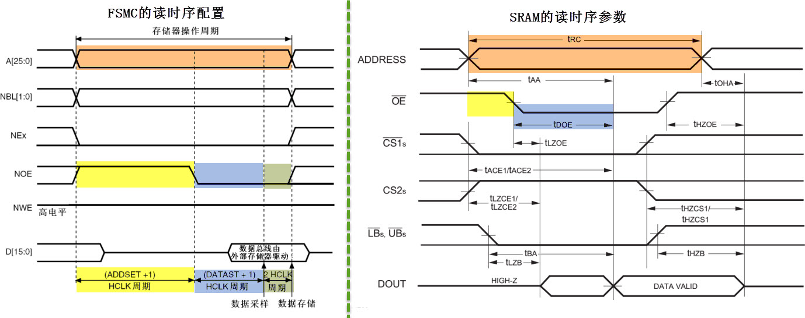

图 26‑12 FSMC时序配置与SRAM时序参数要求对比(读)

   表 26‑5 SRAM的读操作参数(时间要求摘自《IS62WV51216》规格书)

================== ============== ====================================== ==========================
时间参数           SRAM要求       说明                                   FSMC配置要求表达式
t\ :sub:`RC`       不小于55ns     读操作周期                             ADDSET+1+DATAST+1+2 > 55ns
小于t\ :sub:`LZCE` SRAM无给出要求 从发出地址到给出读使能信号的时间       ADDSET+1 > 0 ns
t\ :sub:`DOE`      最迟不大于25ns 从接收到读使能信号至给出有效数据的时间 DATAST+1 > 25 ns
================== ============== ====================================== ==========================

根据FSMC配置表达式的配置要求把时间单位1/72微秒(即1000/72纳秒)代入，可求得ADDSET
= 0，DATAST=1时即可符合要求。如：

t\ :sub:`RC`\ =ADDSET+1+DATAST+1+2 =( 0+1+8+1+2 )*1000/168 = 71.4 ns > 55
ns

t\ :sub:`DOE`\ =DATAST+1 = (8+1)*1000/168 = 53.5 > 25 ns

可看出本实验中的配置有充足的裕量，裕量较大，可确保访问正确，但会导致访问速度变慢，可根据实际需要进行测试调整，保证访问正确的前提下可提高访问速度。不过还需要注意本实验的读时序配置与写时序是一致的，修改时还要确保写时序正常，下面再来列出写时序的计算过程：

由图 26‑13的FSMC时序和SRAM时序对比及SRAM时间参数要求可总结出表
26‑5最右侧的计算表达式。

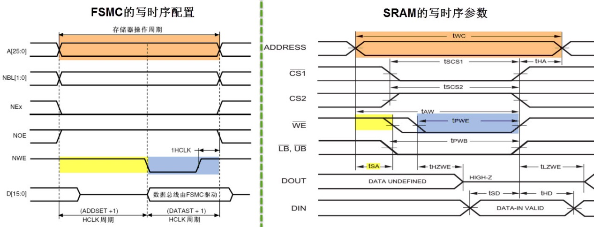

图 26‑13 FSMC时序配置与SRAM时序参数要求对比(写)

表 26‑6 SRAM的写操作参数(时间要求摘自《IS62WV51216》规格书)

============= ================ ==================================== ========================
时间参数      SRAM要求         说明                                 FSMC配置要求表达式
t\ :sub:`WC`  大于55ns         写操作周期                           ADDSET+1+DATAST+1 > 55ns
t\ :sub:`SA`  无要求           地址建立时间                         ADDSET+1 > 0 ns
t\ :sub:`PWB` 最早最不小于40ns 从接收到写使能信号到对数据采样的时间 DATAST+1 > 40 ns
============= ================ ==================================== ========================

根据FSMC配置表达式的配置要求把时间单位1/72微秒(即1000/72纳秒)代入，可求得ADDSET
= 0，DATAST=2时即可符合要求。如：

t\ :sub:`WC` = ADDSET+1+DATAST+1 =( 0+1+8+1 )*1000/168 = 59.5 ns  > 55 ns

t\ :sub:`PWB` = DATAST+1 = (8+1) \*1000 / 168 = 53.5 > 40 ns

把计算得的参数赋值到时序结构体中的AddressSetupTime（即ADDSET的值）及DataSetupTime（即DATAST的值）中，然后再把时序结构体作为指针赋值到下面的FSMC初始化结构体中，作为读写的时序参数，最后再调用FSMC_NORSRAMInit函数即可把参数写入到相应的寄存器中。

(3) 配置FSMC初始化结构体

函数接下来对FSMC
SRAM的初始化结构体赋值。主要包括存储映射区域、存储器类型以及数据线宽度等，这些是根据外接的SRAM的电路设置的。

-  设置存储区域NSBank

..

   Bank成员设置FSMC的SRAM存储区域映射选择为FSMC_Bank1_NORSRAM4，这是由于我们的SRAM硬件连接到FSMC_NE4和NOR/PSRAM相关引脚，
   所以对应到存储区域Bank1 SRAM4，对应的基地址为0x6C000000；

-  存储器类型MemoryType

..

   由于我们控制的是SRAM类型存储器，所以MemoryType成员要选择相应的FSMC_MEMORY_TYPE_SRAM；

-  数据线宽度MemoryDataWidth

..

   根据硬件的数据线连接，数据线宽度被配置为16位宽FSMC_NORSRAM_MEM_BUS_WIDTH_16；

-  写使能WriteOperation

..

   WriteOperation用于设置写使能，只有使能了才能正常使用FSMC向外部存储器写入数据；

-  扩展模式以及读写时序

..

   在ExtendedMode成员中可以配置是否使用扩展模式，当设置扩展模式时，读时序使用FSMC_ReadWriteTimingStruct中的配置，写时序使用FSMC_WriteTimingStruct中的配置，两种配置互相独立，可以赋值为不同的读写时序结构体。在本实例中不使用扩展模式，即读写时序使用相同的配置，都是赋值为前面的readWriteTiming结构体；

-  其它

..

   配置FSMC还涉及到其它的结构体成员，但这些结构体成员与SRAM控制不相关，都被设置为Disable了；

赋值完成后调用库函数FSMC_NORSRAMInit把初始化结构体配置的各种参数写入到FSMC_BCR控制寄存器及FSMC_BTR时序寄存器中。
最后调用FSMC_NORSRAMCmd函数使能要控制的存储区域FSMC_Bank1_NORSRAM4。

使用指针的方式访问SRAM存储器
==============================================

完成初始化SRAM后，我们就可以利用它存储数据了，由于SRAM的存储空间是被映射到内核的寻址区域的，我们可以通过映射的地址直接访问SRAM，访问这些地址时，FSMC外设自动读写SRAM，程序上无需额外操作。

通过地址访问内存，最直接的就是使用C语言的指针方式，见 代码清单26_0_6_。

.. code-block:: c
   :caption: 代码清单 26‑6 使用指针的方式访问SRAM
   :name: 代码清单26_0_6

   /*SRAM起始地址 存储空间4的起始地址*/
   #define Bank1_SRAM4_ADDR     ((uint32_t)0x6C000000)
   /*SRAM大小，1M字节*/
   #define IS62WV51216_SIZE 0x100000

   uint32_t temp;

   /*向SRAM写入8位数据*/
   *( uint8_t*) (Bank1_SRAM4_ADDR ) = (uint8_t)0xAA;
   /*从SRAM读取数据*/
   temp =  *( uint8_t*) (Bank1_SRAM4_ADDR );

   /*写/读 16位数据*/
   *( uint16_t*) (Bank1_SRAM4_ADDR +10 ) = (uint16_t)0xBBBB;
   temp =  *( uint16_t*) (Bank1_SRAM4_ADDR+10 );

   /*写/读 32位数据*/
   *( uint32_t*) (Bank1_SRAM4_ADDR +20 ) = (uint32_t)0xCCCCCCCC;
   temp =  *( uint32_t*) (Bank1_SRAM4_ADDR+20 );

为方便使用，代码中首先定义了宏Bank1_SRAM4_ADDR表示SRAM的起始地址，该地址即FSMC映射的存储区域Bank SRAM4的首地址；
宏IS62WV51216_SIZE表示SRAM的大小，所以从地址(Bank1_SRAM4_ADDR)到(
Bank1_SRAM3_ADDR+ IS62WV51216_SIZE)
都表示在SRAM的存储空间，访问这些地址，直接就能访问SRAM。

配合这些宏，使用指针的强制转换以及取指针操作即可读写SRAM的数据，使用上跟普通的变量无异。

直接指定变量存储到SRAM空间
=================================

每次存取数据都使用指针来访问太麻烦了，为了简化操作，可以直接指定变量存储到SRAM空间，见
代码清单26_0_7_。

.. code-block:: c
   :caption: 代码清单 26‑7 直接指定变量地址的方式访问SRAM
   :name: 代码清单26_0_7

    /* SRAM起始地址 存储空间2的起始地址*/

    #define Bank1_SRAM4_ADDR     ((uint32_t)0x6C000000)

    /* 绝对定位方式访问SRAM,这种方式必须定义成全局变量*/

    uint8_t testValue __attribute__((at(SDRAM_BANK_ADDR)));

    testValue = 0xDD;

这种方式使用关键字“__attribute__((at()))”来指定变量的地址，代码中指定testValue存储到SRAM的起始地址，从而实现把变量存储到SRAM上。要注意使用这种方法定义变量时，必须在函数外把它定义成全局变量，才可以存储到指定地址上。

更常见的是利用这种方法定义一个很大的数组，整个数组都指定到SRAM地址上，然后就像使用malloc函数一样，用户自定义一些内存管理函数，动态地使用SRAM的内存，我们在使用emWin写GUI应用的时候就是这样做的。参考我们配套的“FSMC—外部SRAM（内存管理）”实验可以了解如何自行管理内存。。

然而，我们更推荐另一种方法，在本书的《MDK编译过程及文件类型全解》章节将会讲解使用更简单的方法从SRAM中分配变量，以及使用C语言HAL库的malloc函数来分配SRAM的空间，更有效地进行内存管理。

main函数
''''''''

最后我们来编写main函数，进行SRAM芯片读写校验，见 代码清单26_0_8_。

.. code-block:: c
   :caption: 代码清单 26‑8 main函数
   :name: 代码清单26_0_8

   /*绝对定位方式访问SRAM,这种方式必须定义成全局变量*/
   uint8_t testValue __attribute__((at(Bank1_SRAM4_ADDR)));
   /**
   * @brief  主函数
   * @param  无
   * @retval 无
   */
   int main(void)
   {
      /* 系统时钟初始化成168 MHz */
      SystemClock_Config();
      /* LED 端口初始化 */
      LED_GPIO_Config();
      /* 初始化串口 */
      DEBUG_USART_Config();
      //初始化外部SRAM
      FSMC_SRAM_Init();
      /*蓝灯亮，表示正在读写SRAM测试*/
      LED_BLUE;
      /*对SRAM进行读写测试，检测SRAM是否正常*/
      printf ( "\r\n野火外部 SRAM 测试\r\n" );
      if (SRAM_Test()==1) {
      LED_GREEN;//测试正常 绿灯亮
      } else {
      LED_RED;//测试失败 红灯亮
      }

      /*指针方式访问SRAM*/
      {
      uint32_t temp;
      printf("\r\n指针方式访问SRAM\r\n");
      /*向SRAM写入8位数据*/
      *( uint8_t*) (Bank1_SRAM4_ADDR ) = (uint8_t)0xAA;
      printf("\r\n指针访问SRAM，写入数据0xAA \r\n");
      /*从SRAM读取数据*/
      temp =  *( uint8_t*) (Bank1_SRAM4_ADDR );
      printf("读取数据：0x%X \r\n",temp);
      /*写/读 16位数据*/
      *( uint16_t*) (Bank1_SRAM4_ADDR+10 ) = (uint16_t)0xBBBB;
      printf("指针访问SRAM，写入数据0xBBBB \r\n");
      temp =  *( uint16_t*) (Bank1_SRAM4_ADDR+10 );
      printf("读取数据：0x%X \r\n",temp);
      /*写/读 32位数据*/
      *( uint32_t*) (Bank1_SRAM4_ADDR+20 ) = (uint32_t)0xCCCCCCCC;
      printf("指针访问SRAM，写入数据0xCCCCCCCC \r\n");
      temp =  *( uint32_t*) (Bank1_SRAM4_ADDR+20 );
      printf("读取数据：0x%X \r\n",temp);
      }
      /*绝对定位方式访问SRAM,这种方式必须定义成全局变量*/
      {
      testValue = 0xDD;
      printf("\r\n绝对定位访问SRAM，写入数据0xDD,读出数据0x%X,变量地址为%X\r\n",testValue,(uint32_t )&testValue);
      }
      while (1) {
      }
   }

函数中初始化了LED、串口，接着调用前面定义好的SRAM_Init函数初始化FSMC及SRAM，然后调用自定义的测试函数SRAM_Test尝试使用SRAM存取8、16及32位数据，并进行读写校验，它就是使用指针的方式存取数据并校验而已，此处不展开。

注意对SRAM存储空间的数据操作都要在FSMC_SRAM_Init初始化FSMC之后，否则数据是无法正常存储的。

下载验证
^^^^^^^^

用USB线连接开发板“USB TO
UART”接口跟电脑，在电脑端打开串口调试助手，把编译好的程序下载到开发板。在串口调试助手可看到SRAM测试的调试信息。
